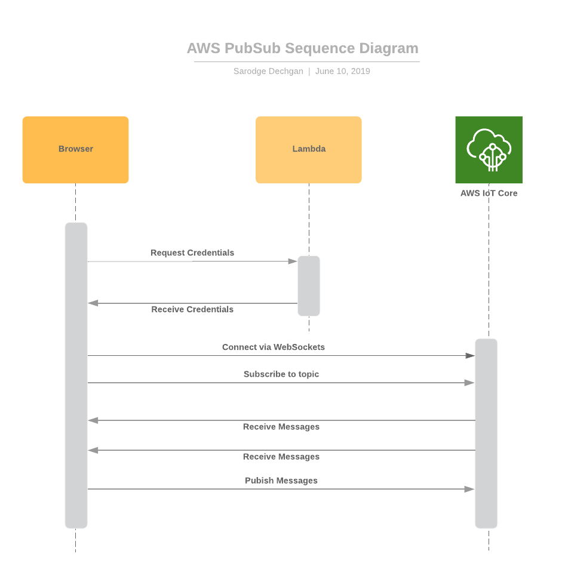

# Cargoplane - Serverless publish/subscribe for webapps and AWS

## What?

Cargoplane is a toolset to help you quickly _transport message cargo_ between webapp clients and a backend running in the AWS cloud.
Unlike other solutions, this one does not rely on a 3rd party (just you and AWS) and is entirely serverless.
Also unlike some alternatives,
you application controls what topics each client has access to subscribe to and which topics they may publish to.

Cargoplane is written in Typescript, but transpiled to Javascript. The Lambda code is compatible with Node.js 8 and 10. The client code is ES5, and so will work in any remotely modern browser.

This project is developed and maintained by the [Onica](https://www.onica.com) Cloud Native Development Practice.

### Example Uses

1. Chat
   - The classic example for this is a chat ability between web site visitors and company support. In fact, a simple version of this serves as the [demo](demo).
2. Push notifications
   - Web app users can be notified of events that have occurred in the cloud.
3. Data Refresh
   - The classic problem with web apps is knowing when the data showing in the browser is outdated. Cargoplane was originally built to solve this problem.
   - When data is changed by one user, a message can be published (by that client or by a Lambda processing the change) to subscribing clients that a change has happened. The other clients then know to refresh their content from the cloud. (Only small data changes should be sent directly through Cargoplane.)

### Communication Flows

1. *Client to Client:* Web app clients can subscribe and publish to the same topics, allowing direct communications between them.
2. *Cloud to Client:* Your cloud code (ex: Lambdas) can easily publish to topics subscribed to by clients.
3. *Client to Cloud?* Generally, existing mechanisms such as API Gateway are better for this. However, it is possible to subscribe Lambdas to topics.
4. *Cloud to Cloud?* Only use Cargoplane this way if the cloud subscriber is in addition to web clients. For pure cloud to cloud, there are better options available within AWS such as SNS.

## Design

In order to achieve the subscribe, publish, and receive capabilities there are two modules:

* cloud: Lambda to give the correct credentials. 
* client: Browser client to send and receive messages.

Here are the steps:
1. Call AWS Lambda to get AWS IoT credentials and endpoint
1. Make MQTT Connection to AWS IoT with credentials 

From there, you can:
1. Subscribe to topics and receive messages
1. Publish messages to topics

### Usage

The cloud and client pieces must be used together in a solution. Documentation for each are in their related READMEs:

- [@cargoplane/cloud](cloud/README.md)
- [@cargoplane/client](client/README.md)

### Demo

The [demo](demo) directory contains a simple chat application to show how to use Cargoplane. It consists of:

1. A Serverless Framework based cloud stack.
1. An Angular webapp client.
1. A React webapp client.
